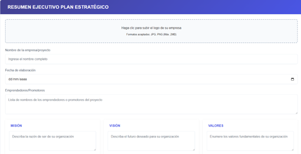
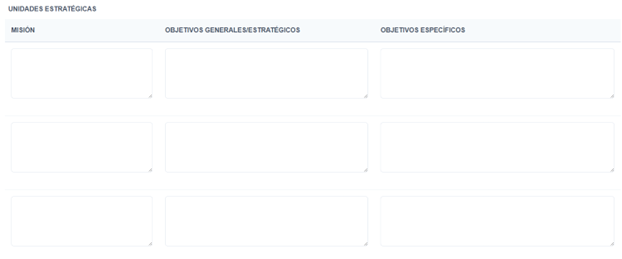
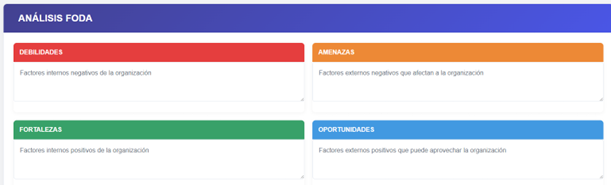
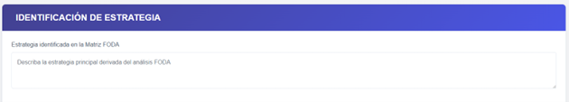
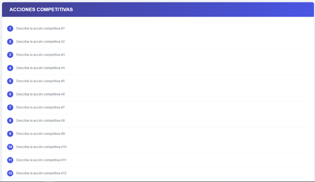
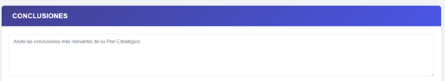

"Examen Práctica Unidad II - PETI", "Brian Danilo Chite Quispe", 28/05/2025

Vamos a realizar los cambios hechos el cual lo que avanze fue que el diseño, añadi un controller y un model.

En esta imagen diseñe un campo donde se vera el resumen ejecutivo Plan Estrategico el cual se vera un añadido de imagen para el logo de empresa el cual se elecciona y se puede escoger cualquier imagen.
Tambien se puso un apartado de Nombre de la empresa.
Tenemos la fecha de elaboracion el cual se vera por el calendario derecho para seleccionar y poner el dia,mes y año. 
Tambien hai apartado de Emprendedores el cual se vera los que trabajaron.
Tambien se vera la mision y vision y valores que se guardaron

En esta segunda imagen se vera las unidades Estrategicas el cual se vera la mision, obejtivos generales estrategicos y objetivos especificos

En este apartado se visualiza el analisis Foda el cual se vera las debilidades, Amenazas,Fortalezas y Oportunidades.

Despues se visualiza la identificacion de estrategia el cual se vera en la Matriz de Foda

Despues se vera las acciones competitivas que se enumerara depende a las acciones.

y por ultimo las conclusiones respectivas de todo.

Para entrar al proyecto primero:

1. Poner composer install
2. copy .env.example .env 
3. npm install 
4. npm run build   
5. npm run dev
6. php artisan key:generate
7. php artisan migrate 
8. php artisan serve
      
Esos son los pasos que se hace para poder entrar al proyecto.

